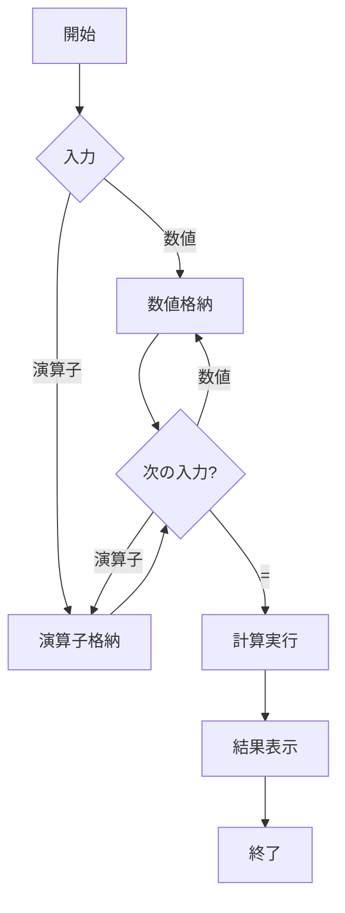

# macos_calc_clone3

## 概要
このプログラムは、シンプルな計算機アプリケーションです。ViteとReactを使用して構築されており、基本的な四則演算（加算、減算、乗算、除算）をサポートしています。デザインは、macOSの電卓に似せています。

## Demo
- https://macos-calc-clone3.vercel.app/

## フローチャート


## シーケンス図
```mermaid
sequenceDiagram
    participant User
    participant App
    User->>App: 数値または演算子を入力
    App->>App: 入力を処理
    App->>App: 計算を実行 (必要な場合)
    App->>User: 結果を表示